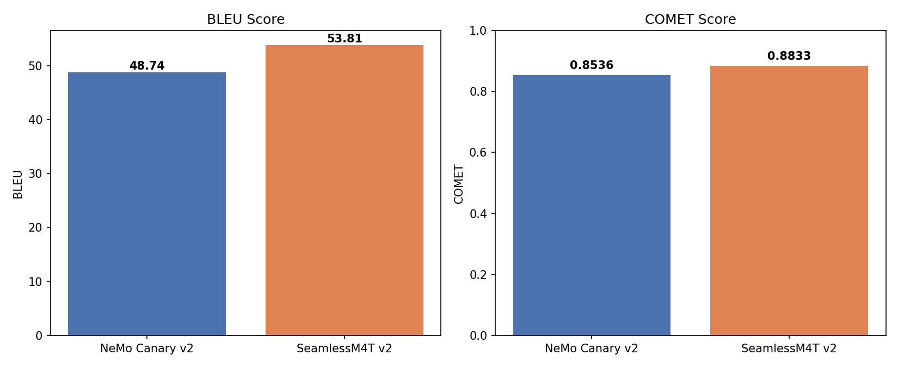
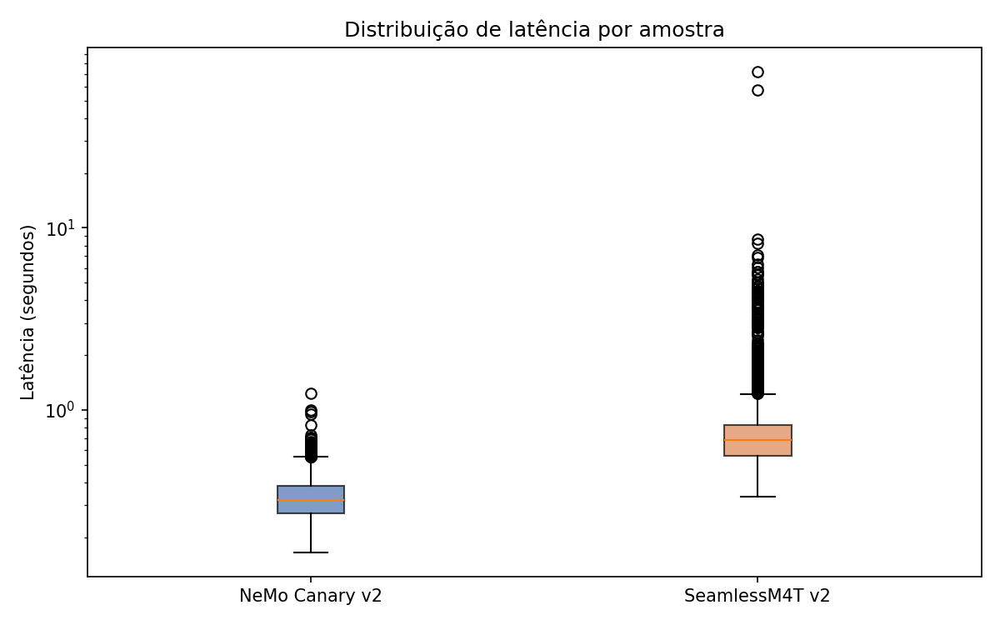

# ASR Benchmark — Tradução Simultânea de Fala (PT → EN)

Benchmark comparativo entre dois sistemas de **Speech Translation (ST)** para tradução de português falado para inglês escrito, avaliando qualidade de tradução e latência de inferência.

---

## 📋 Descrição

Este projeto compara duas arquiteturas de tradução de fala no par **pt → en**:

| Modelo | Arquitetura | Desenvolvedor |
|--------|-------------|---------------|
| **NVIDIA NeMo Canary v2** | Cascata (STT → MT) | NVIDIA |
| **Meta SeamlessM4T v2 Large** | End-to-end (áudio → texto direto) | Meta AI |

A avaliação usa o split de teste do **CoVoST 2** (4.023 amostras) com métricas de qualidade (BLEU, COMET) e latência de inferência.

Além do benchmark, o projeto inclui uma **demo de tradução simultânea em tempo real** via WebSocket, onde o microfone do celular captura áudio e a tradução aparece na tela do PC.

---

## 🏆 Resultados

| Métrica | NeMo Canary v2 | SeamlessM4T v2 |
|---------|:--------------:|:--------------:|
| **BLEU ↑** | 48,74 | **53,81** |
| **COMET ↑** | 0,8536 | **0,8833** |
| **Latência média ↓** | **0,334s** | 0,804s |
| **Latência mediana ↓** | **0,321s** | 0,683s |
| **Desvio padrão** | **0,090s** | 1,531s |

> **Trade-off identificado:** SeamlessM4T supera o Canary em qualidade de tradução (BLEU +5 pts, COMET +0,03), enquanto o Canary é 2,4× mais rápido e muito mais consistente em latência — vantagem crítica para aplicações de tradução simultânea em tempo real.

---

## 📁 Estrutura do Projeto

```
INTELIGENCIA-ARTIFICIAL/
├── data/                                  # Datasets (não versionado no Git)
│   ├── 1781716768543-cv-corpus-26.0-.../ # Common Voice 26.0 (pt) — download manual
│   └── covost2_benchmark_subset/
├── figures/
│   ├── fig1_bleu_comet_comparacao.png
│   ├── fig2_latencia_boxplot.png
│   └── fig3_latencia_sem_outliers.png
├── notebooks/
│   ├── 02_dataset_preparation.ipynb      # Carregamento e inspeção do CoVoST 2
│   ├── 03_inference_benchmark.ipynb      # Inferência SeamlessM4T (local)
│   └── 04_metrics_evaluation.ipynb      # BLEU, COMET, latência e gráficos
├── results/
│   ├── canary_resultados_final.csv       # Saídas do NeMo Canary v2
│   ├── seamless_resultados_final.csv     # Saídas do SeamlessM4T v2
│   ├── tabela_final_comparativa.csv      # Tabela consolidada de métricas
│   └── resumo_comparacao.txt            # Resumo textual dos resultados
├── src/
│   ├── asr_client.py                     # Servidor WebSocket (demo tempo real)
│   └── index.html                        # Interface web para celular
├── .gitignore
├── README.md
└── requirements.txt
```

---

## 🗂️ Dataset

**CoVoST 2** — `facebook/covost2`, configuração `pt_en`, split `test` (4.023 amostras).

O CoVoST 2 **não hospeda os áudios diretamente**. É necessário baixar o Common Voice manualmente:

1. Acesse [commonvoice.mozilla.org/pt/datasets](https://commonvoice.mozilla.org/pt/datasets)
2. Baixe o **Common Voice Corpus** em português (versão 26.0 ou posterior)
3. Extraia o arquivo e mova a pasta para `data/`
4. O caminho final deve conter `clips/`, `test.tsv`, `train.tsv`, etc.

---

## 🚀 Instalação (Ambiente Local — SeamlessM4T)

### Pré-requisitos
- Python 3.10
- Conda (Miniconda ou Anaconda)
- GPU NVIDIA com CUDA (recomendado)

### Configuração

```bash
# 1. Criar e ativar o ambiente conda
conda create -n asr-benchmark python=3.10 -y
conda activate asr-benchmark

# 2. Instalar PyTorch com suporte CUDA
pip install torch==2.1.2 torchaudio==2.1.2 --index-url https://download.pytorch.org/whl/cu121

# 3. Instalar dependências do projeto
pip install datasets==2.18.0
pip install "setuptools<82"   # necessário para compatibilidade do librosa no Windows
pip install transformers accelerate sentencepiece protobuf
pip install sacrebleu unbabel-comet pandas matplotlib librosa soundfile websockets
```

> ⚠️ **Nota Windows:** O `nemo_toolkit` não é instalável no Windows (dependência `triton` sem suporte). O NeMo Canary foi executado no **Google Colab** (ver seção abaixo).

---

## ☁️ Google Colab — NeMo Canary v2

O NeMo Canary v2 foi executado no Google Colab com GPU T4.

**Notebooks Colab:**
- **NeMo Canary:** [03b_nemo_canary_colab.ipynb](https://colab.research.google.com/drive/1cMHRoDG62GMUQwjtBvkeuAotFdDdIHSv?usp=sharing)
- **SeamlessM4T (Colab):** [seamless_colab.ipynb](https://colab.research.google.com/drive/1veMvthwTeX9iVLhVdcVv4yDIO4lsKP1V?usp=sharing)

**Pacotes necessários no Colab:**

```python
!pip install datasets==2.18.0 -q
!pip install nemo_toolkit[asr]==2.7.3 -q
```

---

## 📓 Notebooks (execução local)

### `02_dataset_preparation.ipynb`
Carrega o CoVoST 2 localmente e inspeciona as amostras de áudio.

```python
from datasets import load_dataset

data_dir = "../data/1781716768543-cv-corpus-26.0-2026-06-12-pt/cv-corpus-26.0-2026-06-12/pt"
dataset = load_dataset("facebook/covost2", "pt_en", data_dir=data_dir, split="test")
```

### `03_inference_benchmark.ipynb`
Inferência completa do **SeamlessM4T v2** nas 4.023 amostras com medição de latência.

### `04_metrics_evaluation.ipynb`
Cálculo de **BLEU** e **COMET**, análise de latência, geração dos gráficos comparativos e exportação da tabela final.

---

## 🎙️ Demo em Tempo Real

Sistema de tradução simultânea via WebSocket: microfone do celular → tradução na tela.

### Como usar

**1. Iniciar o servidor HTTP (para servir a página web):**
```bash
python -m http.server 8000
```

**2. Iniciar o servidor WebSocket de tradução:**
```bash
conda activate asr-benchmark
python src/asr_client.py
```

**3. Acessar no celular** (mesma rede Wi-Fi):
```
http://<IP-DO-SEU-PC>:8000/src/index.html
```

**4.** Insira o IP do PC na caixa de texto, clique no botão 🎤 e fale em português. A tradução em inglês aparecerá na tela.

> O servidor acumula ~3 segundos de áudio antes de processar, garantindo contexto suficiente para uma tradução coerente.

---

## 📊 Gráficos

| BLEU e COMET | Distribuição de Latência |
|:---:|:---:|
|  |  |

---

## ⚙️ Dependências principais

```
datasets==2.18.0          # carregamento do CoVoST 2
transformers              # SeamlessM4T via Hugging Face
torch==2.1.2              # backend de deep learning
sacrebleu==2.3.1          # métrica BLEU
unbabel-comet             # métrica COMET (wmt22-comet-da)
librosa==0.10.1           # processamento de áudio
websockets                # servidor WebSocket (demo tempo real)
nemo_toolkit[asr]==2.7.3  # NeMo Canary (somente Linux/Colab)
```

---

## ⚠️ Limitações

- A comparação de **latência** entre os dois modelos foi realizada originalmente em ambientes diferentes (Canary: GPU T4 no Colab; SeamlessM4T: RTX 3050 6GB local), o que constitui uma variável de confusão. Os resultados de **qualidade (BLEU e COMET) não são afetados pelo hardware**.
- O CoVoST 2 é composto por frases curtas e isoladas, não fala contínua de palestra, o que pode não refletir perfeitamente o cenário de tradução simultânea real.
- O SeamlessM4T apresentou 13 amostras com latência anômala (>5s), possivelmente relacionadas a interferência do sistema operacional ou throttling térmico da GPU de laptop.

---

## 📄 Licenças dos modelos

| Modelo | Licença |
|--------|---------|
| NeMo Canary v2 | CC BY 4.0 |
| SeamlessM4T v2 Large | CC BY-NC 4.0 |
| CoVoST 2 | CC BY 4.0 |
| Common Voice 26.0 | CC0 |

---

## 👤 Autor

**David Geraldi, Henrique Manço e Victor Santana** — Projeto de Inteligência Artificial - UNIFESP - Profa. Dra. Lilian Berton